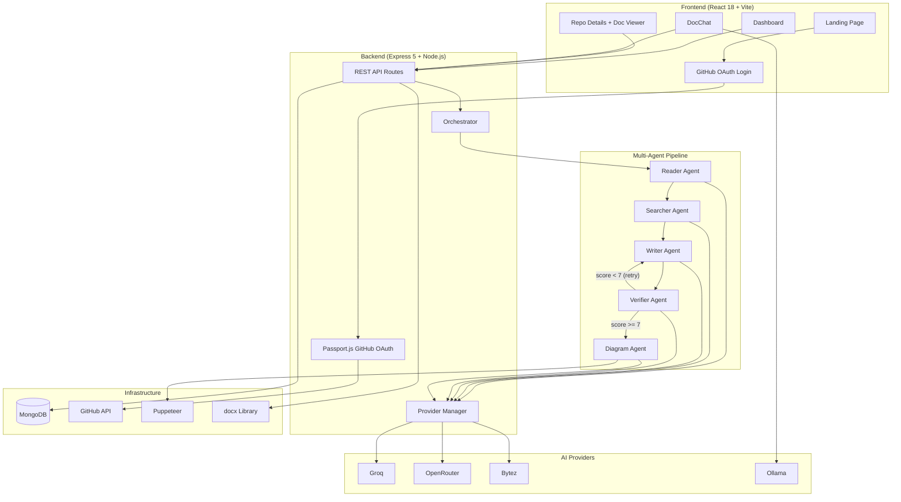
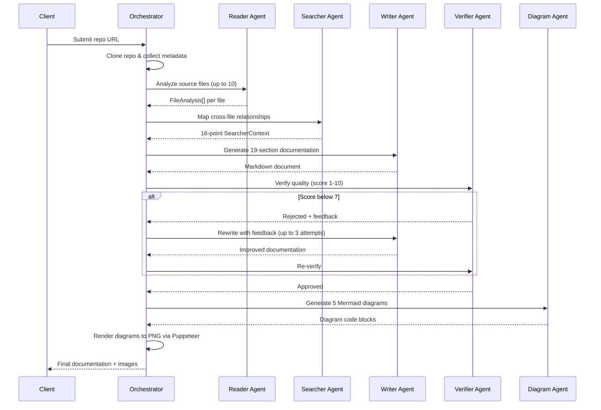
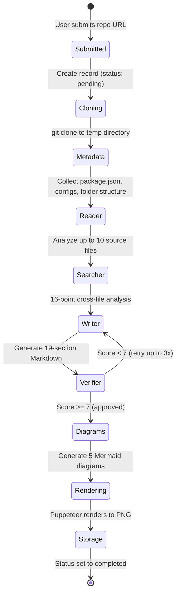

<div align="center">

# DocAgent

### Multi-Agent AI-Powered Code Documentation Generation Platform

[](LICENSE)
[](https://nodejs.org/)
[](https://react.dev/)
[](https://www.mongodb.com/)
[](https://expressjs.com/)
[](https://www.typescriptlang.org/)
[](https://tailwindcss.com/)

**Paste a GitHub URL. Get comprehensive, 19-section documentation with architecture diagrams. Download as DOCX.**

[Features](#features) &bull;
[Architecture](#architecture) &bull;
[Getting Started](#getting-started) &bull;
[Usage](#usage) &bull;
[API Reference](#api-reference) &bull;
[Contributing](#contributing)

</div>

---

## What is DocAgent?

DocAgent is a full-stack web application that transforms any public GitHub repository into comprehensive, professional-grade documentation -- automatically. No templates to fill in, no boilerplate to copy-paste. You sign in with GitHub, submit a repository URL (or pick one from your account), and the system handles the rest.

Under the hood, a pipeline of five specialized AI agents goes to work: one reads your code file by file, another maps relationships across the codebase, a third writes detailed prose across 19 standardized sections, a fourth verifies quality and sends it back for revision if it falls short, and a fifth generates architecture diagrams. The result is a polished document you can preview in-browser and download as a `.docx` file with embedded PNG diagrams.

When you push new commits, DocAgent detects the changes and updates only the affected parts of the documentation, keeping everything else intact. You can also chat with your documentation -- ask questions about the codebase or request edits directly, and the system applies changes to the stored document in real time.

---

## Architecture




---

## Features

### Multi-Agent AI Pipeline
Five specialized agents collaborate in sequence -- Reader, Searcher, Writer, Verifier, and Diagram -- each with its own AI model and system prompt. The Verifier scores the output on a 1-10 scale and sends it back to the Writer if quality falls below 7. Up to 3 Writer attempts ensure consistently good results before anything is saved.

### 19-Section Professional Documentation
Every generated document follows a standardized structure covering the full lifecycle of a software project: Project Information, Executive Summary, Scope of Delivery, System Requirements, Installation Guide, System Architecture, Database Schema, API Documentation, User Manual, Admin Guide, Source Code Delivery, Test Documentation, Training Materials, Release Notes, Support & Maintenance, Security Documentation, Post-Deployment Checklist, Sign-Off & Acceptance, and Appendices.

### Mermaid Diagrams Rendered to PNG
The Diagram Agent generates five diagram types -- flowchart, ER, class, sequence, and state -- as Mermaid code. Puppeteer renders each in a headless browser and screenshots them to PNG files. These images get embedded directly into the DOCX export and displayed inline in the browser documentation viewer.

### Multi-Provider AI with Automatic Fallback
Each agent has a primary AI provider (Groq or OpenRouter) and a Bytez backup. If the primary provider fails for any reason, the system seamlessly falls back to the backup without losing progress. The DocChat feature uses Ollama for streaming with Bytez as its fallback.

### GitHub OAuth and Repo Picker
Sign in with your GitHub account to access a searchable dropdown of your repositories, or paste any public repo URL directly into the input field. The system normalizes URLs and checks for duplicates so you never accidentally analyze the same repo twice.

### Smart Incremental Updates
When you regenerate documentation for a previously processed repository, DocAgent compares the latest commit hash against the one stored from the last run. Only files that actually changed get re-analyzed, and the existing documentation is updated rather than rewritten from scratch.

### Interactive DocChat
A floating chat panel on the documentation view lets you have a conversation with your docs. Ask questions like "What database does this project use?" and get answers grounded in the actual documentation content. You can also request edits -- the system detects edit intent through phrase matching, applies changes using the Writer agent, and streams the response back in real time.

### DOCX Export
One click generates a Word document with properly formatted headings, bullet lists, code blocks, and embedded diagram PNGs -- ready to hand off to stakeholders, attach to a compliance report, or archive for your records.

### Real-Time Status Tracking
Repository status flows through `pending` -> `processing` -> `completed` (or `failed`). The dashboard polls for updates automatically, so you see progress as it happens without needing to refresh the page.

### Quality Score Display
Each generated document shows its Verifier quality score (out of 10) alongside a color-coded badge -- making it easy to see at a glance which docs met the quality bar and which might benefit from regeneration.

---

## Tech Stack

| Layer | Technology |
|-------|-----------|
| **Frontend** | React 18, TypeScript, Vite 7, Tailwind CSS 3.4, Shadcn/UI (Radix primitives), Framer Motion, TanStack React Query, Wouter, React Markdown, Mermaid.js, Recharts |
| **Backend** | Node.js, Express 5, TypeScript, Mongoose 9 (ODM) |
| **Database** | MongoDB (local or Atlas) |
| **Authentication** | GitHub OAuth 2.0 via Passport.js, cookie-based sessions |
| **AI Providers** | Groq SDK, OpenRouter (via OpenAI SDK), Bytez.js, Ollama REST API |
| **Document Generation** | `docx` library for Word files, Puppeteer for Mermaid-to-PNG rendering |
| **Git Operations** | Simple-Git for cloning, diffing, and commit history |
| **Validation** | Zod schemas shared between client and server |
| **Build Tools** | Vite (frontend), tsx + esbuild (server), cross-env |

---

## How the AI Pipeline Works

Each agent is a specialist with its own system prompt, AI model, and clearly defined task. The orchestrator coordinates them in sequence, with a quality feedback loop between the Writer and Verifier.



### Agent Details

| Agent | Primary Model | Provider | Fallback | Role |
|-------|--------------|----------|----------|------|
| **Reader** | `openai/gpt-oss-120b` | Groq | Bytez (`openai/gpt-oss-20b`) | Analyzes individual source files: extracts functions, classes, dependencies, API endpoints, database models, security patterns, config handling, error handling, and state transitions |
| **Searcher** | `qwen/qwen3-32b` | OpenRouter | Bytez (`Qwen/Qwen3-4B-Instruct`) | Performs 16-point cross-file analysis: architecture patterns, data flow, API surface, database schema, security architecture, deployment, state flows, and more |
| **Writer** | `llama-3.3-70b-versatile` | Groq | Bytez (`meta-llama/Meta-Llama-3-8B`) | Generates the full 19-section Markdown document using file analyses, searcher context, and project metadata |
| **Verifier** | `llama3.1-8b` | Groq | Bytez (`Qwen/Qwen3-4B-Thinking`) | Scores documentation 1-10 on section completeness (all 19 required), diagram completeness (at least 3 of 5 types), content quality, and structure. Score >= 7 means approved |
| **Diagram** | `qwen/qwen3-4b:free` | OpenRouter | Bytez (`Qwen/Qwen2-VL-2B-Instruct`) | Generates or improves 5 Mermaid diagram types: flowchart, ER, class, sequence, and state |
| **Chat** | `qwen3-coder:480b-cloud` | Ollama | Bytez (`Qwen/Qwen3-235B-A22B`) | Streaming conversational Q&A and real-time documentation editing |

---

## Getting Started

### Prerequisites

- **Node.js** v18 or later -- [download here](https://nodejs.org/)
- **MongoDB** running locally or a [MongoDB Atlas](https://www.mongodb.com/atlas) connection string
- **Git** installed and available on your PATH
- At least one AI provider API key (**Groq** recommended for fastest results)
- A **GitHub OAuth App** for authentication -- [create one here](https://github.com/settings/developers)

### Installation

1. **Clone the repository**

   ```bash
   git clone https://github.com/your-username/docagent.git
   cd docagent
   ```

2. **Install dependencies**

   ```bash
   npm install
   ```

3. **Create your environment file**

   Create a `.env` file in the project root:

   ```env
   # Server
   PORT=5001

   # Database
   MONGODB_URI=mongodb://localhost:27017/docagent

   # AI Providers (at least GROQ_API_KEY or OPENROUTER_API_KEY required)
   GROQ_API_KEY=gsk_your_key_here
   OPENROUTER_API_KEY=sk-or-your_key_here
   BYTEZ_API_KEY=your_bytez_key_here
   OLLAMA_API_KEY=your_ollama_key_here

   # GitHub OAuth
   GITHUB_CLIENT_ID=your_github_client_id
   GITHUB_CLIENT_SECRET=your_github_client_secret
   GITHUB_CALLBACK_URL=http://localhost:5001/api/auth/github/callback

   # Session
   SESSION_SECRET=a-long-random-secret-string
   ```

4. **Start in development mode**

   ```bash
   npm run dev
   ```

   The app will be available at **http://localhost:5001**.

5. **Build for production** (optional)

   ```bash
   npm run build
   npm start
   ```

### Setting Up GitHub OAuth

1. Go to **[GitHub Developer Settings](https://github.com/settings/developers)**
2. Click **New OAuth App**
3. Set **Homepage URL** to `http://localhost:5001`
4. Set **Authorization callback URL** to `http://localhost:5001/api/auth/github/callback`
5. Copy the **Client ID** and **Client Secret** into your `.env` file

---

## Usage

### 1. Sign In

Navigate to the landing page and click **"Get Started with GitHub"**. You'll be redirected to GitHub to authorize the application, then brought back to the dashboard.

### 2. Submit a Repository

On the dashboard, you can either:
- **Paste a URL** -- enter any public GitHub repository URL into the input field
- **Pick from your repos** -- use the searchable dropdown that lists repositories from your GitHub account

Click **Generate** to kick off the pipeline.

### 3. Watch Progress

Each repository card on the dashboard shows its current status:
- **Pending** -- queued and waiting to be processed
- **Processing** -- AI agents are actively analyzing the code
- **Completed** -- documentation is ready to view and download
- **Failed** -- something went wrong (you can retry or regenerate)

### 4. View Documentation

Click on any completed repository to open the full documentation viewer. All 19 sections are rendered as Markdown with Mermaid diagrams displayed inline.

### 5. Chat with Your Docs

Click the floating chat button in the bottom-right corner of the documentation view. You can:
- **Ask questions**: *"What authentication method does this project use?"*
- **Request edits**: *"Add more detail about the database schema"* -- the system detects your intent and applies changes to the stored documentation automatically.

### 6. Download

Click **Download DOCX** to get a professionally formatted Word document with all sections and embedded diagram images.

### 7. Regenerate or Update

- **Regenerate** -- wipes existing documentation and runs the full pipeline from scratch
- **Smart Update** -- when a previously documented repo has new commits, submitting it again only analyzes the changed files and updates the existing document

---

## Project Structure

```
docagent/
├── client/                              # React frontend application
│   ├── index.html                       # HTML entry point
│   └── src/
│       ├── App.tsx                      # Route definitions (Wouter)
│       ├── index.css                    # Global styles + Tailwind
│       ├── components/
│       │   ├── Layout.tsx               # Authenticated page wrapper with navbar
│       │   ├── RepoCard.tsx             # Repository card for dashboard grid
│       │   ├── StatusBadge.tsx          # Color-coded status indicator
│       │   ├── DocChat.tsx              # Floating chat panel with SSE streaming
│       │   ├── RepoPickerCombobox.tsx   # GitHub repo dropdown selector
│       │   └── ui/                      # Shadcn/UI component library (50+ components)
│       ├── hooks/
│       │   ├── use-repos.ts             # TanStack Query hooks for repo CRUD
│       │   ├── use-auth.ts              # Authentication state management
│       │   └── use-github-repos.ts      # Fetch user's GitHub repositories
│       ├── lib/
│       │   ├── utils.ts                 # cn() utility and helpers
│       │   └── queryClient.ts           # TanStack Query client configuration
│       └── pages/
│           ├── Landing.tsx              # Public landing page
│           ├── Login.tsx                # GitHub OAuth login
│           ├── Home.tsx                 # Dashboard with repo submission + grid
│           └── RepoDetails.tsx          # Documentation viewer + Mermaid rendering
│
├── server/                              # Express backend
│   ├── index.ts                         # Server entry: Express setup, middleware, startup
│   ├── routes.ts                        # API route handlers + processRepo pipeline
│   ├── storage.ts                       # MongoDB data access layer (IStorage interface)
│   ├── db.ts                            # Mongoose connection setup
│   ├── auth.ts                          # Passport.js GitHub OAuth strategy + sessions
│   ├── diagram-renderer.ts             # Puppeteer-based Mermaid-to-PNG rendering
│   ├── static.ts                        # Production static file serving
│   ├── vite.ts                          # Vite dev server integration
│   └── ai-agents/
│       ├── doc-generator.ts             # Pipeline entry point (clone, metadata, orchestrate)
│       ├── orchestrator.ts              # 5-stage pipeline coordination with retry logic
│       ├── agents/
│       │   ├── reader-agent.ts          # File-by-file code analysis
│       │   ├── searcher-agent.ts        # Cross-file relationship mapping (16-point)
│       │   ├── writer-agent.ts          # 19-section documentation generation
│       │   ├── verifier-agent.ts        # Quality verification and scoring
│       │   └── diagram-agent.ts         # Mermaid diagram generation
│       ├── providers/
│       │   ├── types.ts                 # AIProvider interface, ChatMessage, ModelConfig
│       │   ├── provider-manager.ts      # Agent-to-model routing with automatic fallback
│       │   ├── groq-provider.ts         # Groq SDK wrapper
│       │   ├── openrouter-provider.ts   # OpenRouter via OpenAI SDK
│       │   ├── bytez-provider.ts        # Bytez.js wrapper (universal fallback)
│       │   └── openrouter-chat.ts       # Ollama streaming + Bytez fallback for DocChat
│       └── types/
│           └── project-metadata.ts      # ProjectMetadata interface (40+ fields)
│
├── shared/                              # Shared between client and server
│   ├── schema.ts                        # Zod schemas for Repo, Documentation, User
│   └── routes.ts                        # Declarative API contract (paths, methods, types)
│
├── package.json                         # Dependencies and scripts
├── vite.config.ts                       # Vite config with path aliases (@, @shared)
├── tsconfig.json                        # TypeScript configuration
└── .env                                 # Environment variables (not committed)
```

---

## API Reference

All API routes require authentication (cookie-based session) unless noted otherwise.

### Authentication

| Method | Endpoint | Description |
|--------|----------|-------------|
| `GET` | `/api/auth/github` | Initiate GitHub OAuth flow |
| `GET` | `/api/auth/github/callback` | OAuth callback handler (redirects to `/dashboard`) |
| `GET` | `/api/auth/user` | Get current authenticated user |
| `POST` | `/api/auth/logout` | Destroy session and log out |

### Repositories

| Method | Endpoint | Description |
|--------|----------|-------------|
| `GET` | `/api/repos` | List all repositories |
| `POST` | `/api/repos` | Submit a new repo URL for analysis |
| `GET` | `/api/repos/:id` | Get a single repository |
| `PATCH` | `/api/repos/:id` | Update a repository's URL |
| `DELETE` | `/api/repos/:id` | Delete a repository and its documentation |
| `POST` | `/api/repos/:id/regenerate` | Wipe and regenerate documentation |

### Documentation

| Method | Endpoint | Description |
|--------|----------|-------------|
| `GET` | `/api/repos/:id/doc` | Get generated documentation (Markdown content) |
| `GET` | `/api/repos/:id/download` | Download documentation as `.docx` file |

### Chat

| Method | Endpoint | Description |
|--------|----------|-------------|
| `POST` | `/api/repos/:id/chat` | Stream a chat response (SSE format) |

### GitHub

| Method | Endpoint | Description |
|--------|----------|-------------|
| `GET` | `/api/github/repos` | Fetch the authenticated user's GitHub repositories |

### Request & Response Examples

**Submit a repository:**

```http
POST /api/repos
Content-Type: application/json

{
  "url": "https://github.com/owner/repo"
}
```

```json
{
  "id": "664a1b2c3d4e5f6a7b8c9d0e",
  "url": "https://github.com/owner/repo",
  "status": "pending",
  "createdAt": "2025-01-15T10:30:00.000Z",
  "updatedAt": "2025-01-15T10:30:00.000Z"
}
```

**Chat with documentation:**

```http
POST /api/repos/:id/chat
Content-Type: application/json

{
  "message": "What database does this project use?",
  "history": []
}
```

```
data: {"content":"This project uses "}
data: {"content":"MongoDB with Mongoose as the ODM..."}
data: [DONE]
```

---

## How It Works



### Step by Step

1. **URL Submission** -- The frontend sends a normalized GitHub URL to `POST /api/repos`. The server creates a database record with status `pending` and kicks off background processing.

2. **Repository Cloning** -- `processRepo()` fires asynchronously. It clones the repository into a temporary directory using Simple-Git.

3. **Change Detection** -- If this repo was previously processed, the system compares the new HEAD commit against the stored `lastCommitHash` to identify which files changed since the last run.

4. **Metadata Collection** -- `collectProjectMetadata()` reads `package.json`, the README, `.env.example`, Docker files, test directories, CI/CD configs, folder structure, language statistics, and recent commit history. Over 40 metadata fields are extracted.

5. **Reader Agent** -- Analyzes up to 10 source files individually. For each file, it extracts a summary, function signatures, class definitions, import dependencies, control flow description, API endpoints, database models, security patterns, configuration handling, error handling, and state transitions.

6. **Searcher Agent** -- Takes all file analyses and produces a 16-point report covering architecture patterns, data flow graphs, the full API surface, database schema, security architecture, configuration map, testing strategy, deployment setup, state machines, error handling strategy, user roles, external services, and the complete tech stack.

7. **Writer Agent** -- Receives the file analyses, searcher context, and project metadata. Produces a comprehensive Markdown document with all 19 required sections and embedded Mermaid code blocks for at least 4 diagram types.

8. **Verifier Agent** -- Reviews the documentation against the source code analyses. Checks for all 19 sections, at least 3 diagram types, substantive content quality, and proper Markdown structure. Scores 1-10. If the score is below 7, detailed feedback goes back to the Writer for another attempt (up to 3 total).

9. **Diagram Agent** -- Generates or improves 5 Mermaid diagram types (flowchart, ER, class, sequence, state) based on the final documentation. The orchestrator merges new diagrams into the document. Diagram generation is non-blocking -- failures here don't prevent the documentation from being saved.

10. **Mermaid Rendering** -- Puppeteer opens each Mermaid code block in a headless browser, waits for the SVG to render, and screenshots it to a PNG stored in `public/diagrams/{repoId}/`. Image references replace the raw Mermaid code blocks in the final Markdown.

11. **Storage** -- The final Markdown (with image references), quality score, and diagram image paths are saved to MongoDB. The repository status updates to `completed` and the latest commit hash is recorded for future change detection.

12. **Cleanup** -- The cloned temporary directory is deleted regardless of whether the pipeline succeeded or failed.

---

## Environment Variables

| Variable | Required | Description |
|----------|----------|-------------|
| `PORT` | No | Server port (default: `5001`) |
| `MONGODB_URI` | Yes | MongoDB connection string (e.g., `mongodb://localhost:27017/docagent`) |
| `GROQ_API_KEY` | Yes* | API key for [Groq](https://console.groq.com/) -- used by Reader, Writer, and Verifier agents |
| `OPENROUTER_API_KEY` | Yes* | API key for [OpenRouter](https://openrouter.ai/) -- used by Searcher and Diagram agents |
| `BYTEZ_API_KEY` | No | API key for [Bytez](https://bytez.com/) -- universal fallback for all agents |
| `OLLAMA_API_KEY` | No | API key for [Ollama](https://ollama.com/) -- used by DocChat streaming |
| `GITHUB_CLIENT_ID` | Yes | GitHub OAuth App client ID |
| `GITHUB_CLIENT_SECRET` | Yes | GitHub OAuth App client secret |
| `GITHUB_CALLBACK_URL` | No | OAuth callback URL (default: `http://localhost:5001/api/auth/github/callback`) |
| `SESSION_SECRET` | Yes | Secret string for signing session cookies |

*At least one of `GROQ_API_KEY` or `OPENROUTER_API_KEY` is required. Both are recommended so all agents can use their primary provider. Without `BYTEZ_API_KEY`, automatic fallback will not be available.*

---

## Contributing

Contributions are welcome. Here is how to get started:

1. **Fork** the repository
2. **Create a branch** for your feature or fix:
   ```bash
   git checkout -b feature/your-feature-name
   ```
3. **Make your changes** and ensure:
   - TypeScript compiles without errors: `npm run check`
   - The application starts successfully: `npm run dev`
4. **Commit** with a clear message describing the change
5. **Open a Pull Request** against `main`

### Development Notes

- The frontend dev server runs through Vite with HMR, proxied through Express in development mode.
- Path aliases: `@` maps to `client/src/`, `@shared` maps to `shared/`.
- Zod schemas in `shared/schema.ts` are the single source of truth for types used on both client and server.
- The provider manager in `server/ai-agents/providers/provider-manager.ts` is where you would add new AI providers or change which model each agent uses.
- All API routes are defined declaratively in `shared/routes.ts` and implemented in `server/routes.ts`.

---

## License

This project is licensed under the [MIT License](LICENSE).

---

## Acknowledgments

DocAgent is built on top of several outstanding open-source projects and AI services:

- [Groq](https://groq.com/) -- ultra-fast LLM inference
- [OpenRouter](https://openrouter.ai/) -- unified API for multiple AI models
- [Bytez](https://bytez.com/) -- affordable model hosting
- [Ollama](https://ollama.com/) -- local and cloud LLM hosting
- [Shadcn/UI](https://ui.shadcn.com/) -- beautiful, accessible React components
- [Mermaid.js](https://mermaid.js.org/) -- diagrams from text
- [Puppeteer](https://pptr.dev/) -- headless Chrome automation
